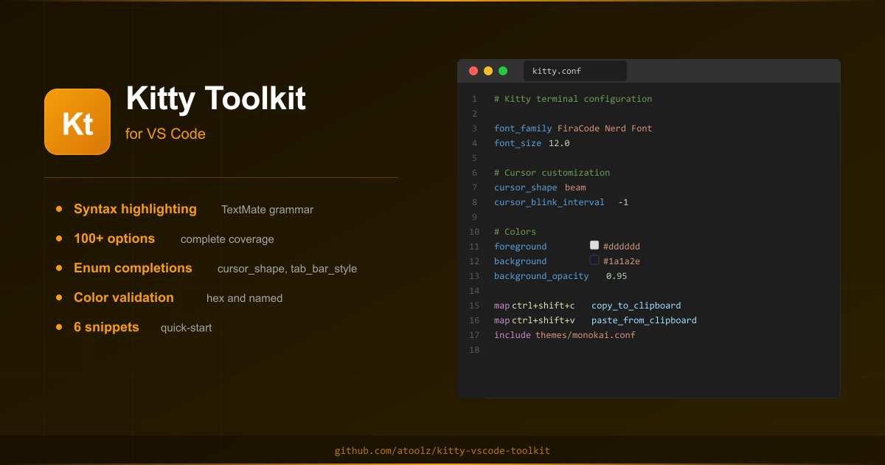
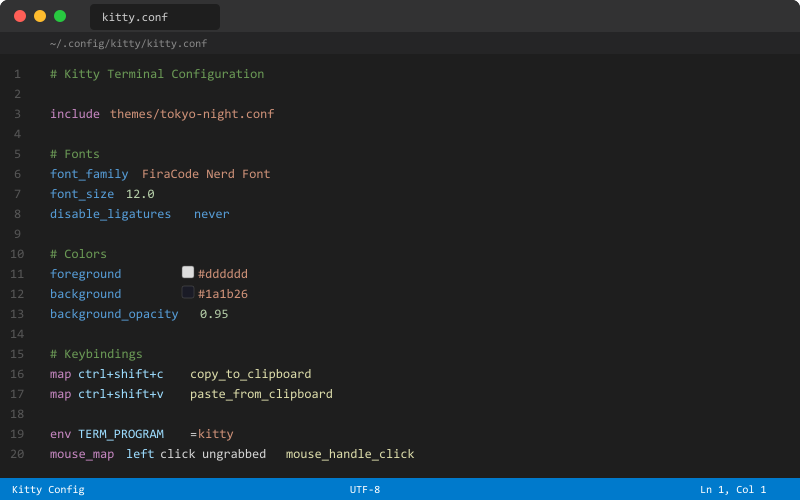
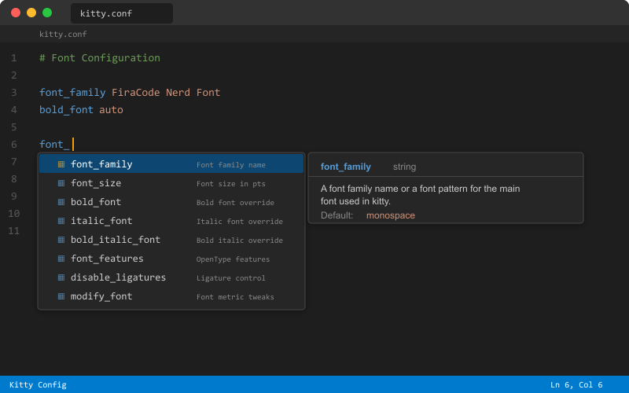
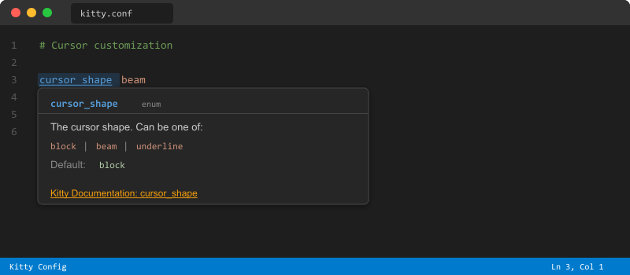
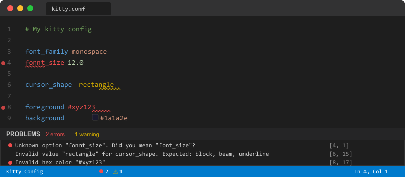

<p align="center">
  
</p>

<h1 align="center">Kitty Toolkit</h1>

<p align="center">
  <strong>Syntax highlighting, IntelliSense, validation, and documentation for <code>kitty.conf</code> configuration</strong>
</p>

<p align="center">
  <a href="https://marketplace.visualstudio.com/items?itemName=atoolz.kitty-vscode-toolkit">
    
  </a>
  <a href="https://marketplace.visualstudio.com/items?itemName=atoolz.kitty-vscode-toolkit">
    
  </a>
  <a href="https://marketplace.visualstudio.com/items?itemName=atoolz.kitty-vscode-toolkit">
    
  </a>
  <a href="https://github.com/atoolz/kitty-vscode-toolkit/blob/main/LICENSE">
    
  </a>
  <a href="https://sw.kovidgoyal.net/kitty/">
    
  </a>
</p>

---

[Kitty](https://sw.kovidgoyal.net/kitty/) is a fast, feature-rich, GPU-based terminal emulator. This extension brings first-class editing support for `kitty.conf` configuration files directly into VS Code, with dedicated syntax highlighting, completions, hover docs, and validation.

## Features

### Syntax Highlighting

Dedicated TextMate grammar built specifically for `kitty.conf`. Unlike generic config highlighters, this grammar understands kitty's unique syntax: comments, directives (`map`, `mouse_map`, `include`, `globinclude`, `env`), key-value options, hex colors, booleans, numbers, and action names.

<p align="center">
  
</p>

### IntelliSense Completions

Full autocompletion for all 100+ kitty options with context-aware suggestions.

- **Option names** with descriptions, types, and defaults
- **Enum values** for options like `cursor_shape`, `tab_bar_style`, `placement_strategy`
- **Color names** for color options with hex validation
- **Action names** for `map` and `mouse_map` directives

<p align="center">
  
</p>

### Hover Documentation

Hover over any option name to see its description, type, default value, accepted values for enums, and a direct link to the kitty documentation.

<p align="center">
  
</p>

### Diagnostics and Validation

Real-time validation catches configuration errors as you type:

- Unknown option names with "did you mean?" suggestions
- Invalid enum values with the list of accepted values
- Invalid hex color codes
- Type mismatches (string where number expected, etc.)

<p align="center">
  
</p>

### Snippets

Quick-start templates for common configurations:

| Prefix | Description |
|---|---|
| `kitty-starter` | Basic kitty.conf starter template |
| `kitty-fonts` | Font configuration block |
| `kitty-colors` | Color scheme configuration |
| `kitty-keybinds` | Common keybinding configuration |
| `kitty-tabs` | Tab bar configuration |
| `kitty-window` | Window layout configuration |

## Supported Categories

All major kitty configuration categories are covered:

`Fonts` `Cursor` `Scrollback` `Mouse` `Performance` `Terminal Bell` `Window Layout` `Tab Bar` `Colors` `Advanced`

## Installation

1. Open VS Code
2. Go to Extensions (`Ctrl+Shift+X` / `Cmd+Shift+X`)
3. Search for **Kitty Toolkit**
4. Click **Install**

Or install from the command line:

```bash
code --install-extension atoolz.kitty-vscode-toolkit
```

## Requirements

- VS Code 1.85.0 or higher

No additional extensions needed. Kitty Toolkit includes its own TextMate grammar for `kitty.conf` syntax highlighting.

The extension activates automatically when you open a file named `kitty.conf`.

## Contributing

Contributions are welcome. Please open an issue or pull request on [GitHub](https://github.com/atoolz/kitty-vscode-toolkit).

## License

[MIT](LICENSE)
